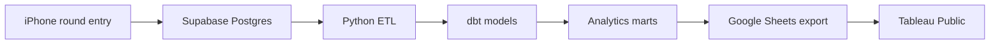

# Fairway Log

I play a lot of golf, but I usually remember the good shots more clearly than the patterns that actually shape a round. Fairway Log is my attempt to change that.

It is a personal golf journal and data project for recording each hole as I play, cleaning the data, and turning it into something useful in Tableau. The goal is to learn more about my own game while building an end-to-end data platform around information I genuinely care about.

> **Current status:** early build. I am starting with reliable on-course data capture before moving on to the pipelines and dashboard.

## What I plan to record

For every hole:

- Score and par
- Putts and estimated first-putt distance
- Tee and approach accuracy
- Penalty strokes
- Tee and approach clubs
- Course, tee, hole, and yardage

Greens in regulation and fairways in regulation will be calculated from the underlying hole data instead of entered manually.

## The idea

The round-entry app will work offline on an iPhone and sync when a connection returns. Supabase will hold the private source data. Python will handle validation and cleaning, dbt will build the analytical models, and a curated version of the data will feed a public Tableau dashboard.

Only finished rounds and privacy-safe fields will be published. Exact dates, account details, and raw submissions will stay private.

## What I want to explore

- Where I tend to miss from the tee and on approach shots
- How GIR, FIR, penalties, and putting affect my score
- Whether certain clubs produce more consistent outcomes
- How my game changes by course, hole length, and par
- Whether the data supports any useful scoring model once I have enough rounds

## Build order

- [ ] Offline-friendly iPhone round entry
- [ ] Course, tee, and club setup
- [ ] Supabase database and secure synchronization
- [ ] Python cleaning and ETL pipeline
- [ ] dbt warehouse models and data-quality tests
- [ ] Automated Tableau dataset publishing
- [ ] Tableau Public dashboard
- [ ] Statistical analysis and scoring model

More detail is available in the [project roadmap](docs/roadmap.md) and [data notes](docs/data-notes.md).

## Tools

React, TypeScript, Supabase, PostgreSQL, Python, dbt, GitHub Actions, Google Sheets, and Tableau Public.

## Why “Fairway Log”?

Because the project is less about chasing a perfect swing and more about keeping an honest record of what happened.

