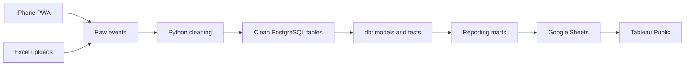

# Architecture

Fairway Log is a personal golf tracker first and a data project second. The system should be useful on the course even if the analytics pieces are temporarily unavailable.

The [implementation plan](implementation-plan.md) defines the task sequence, interfaces, and acceptance checks. Its shared decisions clarify the edge cases summarized here.

## What complete means

The first complete version will:

- Record 9-hole and 18-hole rounds from an iPhone, including without reception
- Synchronize a round without duplicating edited or retried holes
- Import more than 250 historical rounds from a fixed Excel template
- Keep raw inputs, cleaned records, and reporting models separate
- Run cleaning, tests, and publishing automatically
- Display finished, privacy-safe rounds in Tableau Public
- Add statistical analysis immediately and delay modeling until enough data exists

## Build order

1. Define the data contract and create the Supabase foundation.
2. Build the smallest useful iPhone capture app.
3. Add the historical spreadsheet importer.
4. Build the Python ETL and dbt warehouse.
5. Publish the Tableau dashboard.
6. Add the data-science work after at least 360 completed holes exist.

This order keeps the project tied to its real purpose. The app can record a round before the reporting platform is complete, while every later part builds on data the project genuinely produces.

## System shape

Supabase provides PostgreSQL, private file storage, email-and-password authentication, and row-level security. The capture app is a small React progressive web app hosted as a static site. GitHub Actions runs code checks and the scheduled data workflow.

Supabase is the source of truth. Google Sheets is only a delivery layer for Tableau Public's daily extract refresh.

## Data sources

### iPhone capture

The app saves each hole to IndexedDB before attempting a network request. An active round survives the app closing, an expired session, or loss of reception. Synchronization resumes when the app opens online or the user retries it.

Rounds have stable UUIDs and holes have stable numbers within a round. The app synchronizes complete round snapshots with a unique mutation ID and the last acknowledged server revision. Supabase acknowledges identical retries and returns a conflict when the base revision is stale; the app retains local edits until that conflict is resolved. Device clocks do not decide which edit wins.

The app includes only four areas: active round, course setup, My Bag, and history. The interface favors large controls, short forms, and visible local/synchronized status over decorative features.

### Spreadsheet import

The private app also accepts a fixed `.xlsx` workbook with one row per hole. Original workbooks remain in private storage. Python validates and imports each round atomically, allowing valid rounds to load when another round in the same file is rejected.

The complete workbook contract, correction behavior, limits, and error rules are defined in [Spreadsheet Import Design](superpowers/specs/2026-09-15-spreadsheet-import-design.md).

App and spreadsheet records share operational history and canonical tables but retain their source type and raw lineage. A possible duplicate across the two sources is held out of reporting until the owner chooses which record to keep or confirms that both are distinct rounds. Neither raw history is deleted.

## Golf data contract

A course contains tee sets, and each tee set contains hole number, par, and yardage. Starting a round snapshots par and yardage so later course edits do not rewrite history.

Each completed hole records:

- Score, par, and yardage
- Putts and estimated first-putt distance in whole feet
- Tee and approach accuracy
- Penalties
- Tee and approach clubs

Course distance uses yards. Tee club is required and approach club is optional. On par 3s, tee accuracy is also approach accuracy.

Inferred GIR is true when `score - putts <= par - 2`. This is a proxy and can differ from actual regulation status in exceptional holes, including chip-ins or leaving a green. FIR is true for a par 4 or 5 when tee accuracy is `Fairway` or `Green`, false for other recorded outcomes, and not applicable on par 3s or when the tee result is `Not applicable`. Neither metric is manually editable.

## ETL and ELT

The private raw layer keeps immutable, versioned app events and spreadsheet rows. This makes every cleaned table reproducible from its sources.

The Python ETL job:

1. Extracts committed events absent from its durable processing ledger, so out-of-order commits cannot be skipped by a sequence watermark.
2. Validates types, ranges, references, completeness, revisions, and cross-field golf rules.
3. Normalizes supported labels and removes duplicate retries.
4. Loads valid records into canonical tables.
5. Sends invalid records to quarantine with stable error codes and source locations.
6. Records input, accepted, rejected, timing, and failure counts for each run.

The job also supports a full replay. Reprocessing the same inputs must produce the same clean records.

dbt performs ELT inside PostgreSQL. It creates staging models, course/hole/club/date dimensions, hole and round facts, and Tableau-ready marts. Tests cover grain, uniqueness, required values, relationships, accepted labels, and the GIR/FIR rules.

## Automation

GitHub Actions is the only orchestrator in version 1.

- Pull requests and pushes run application, Python, SQL, privacy, and dbt checks.
- A scheduled or manually started workflow runs ETL, then dbt, then statistics, then the Google Sheets export.
- A failed stage prevents dependent publishing stages from running.
- Publication begins only after all output has been built and validated, so a failed run leaves the previous public dataset in place.
- Supabase and Google credentials live in GitHub secrets and never in the repository.

This project does not introduce Airflow or Dagster unless future pipeline complexity creates a real need for them.

## Tableau and privacy

Tableau Public receives only completed rounds. It may display course names, month and year, round sequence, hole attributes, clubs, and derived performance measures.

It does not receive exact playing dates, tee times, user or authentication identifiers, filenames, raw payloads, import errors, or unfinished rounds. The public dataset includes its last successful refresh time and row counts.

The dashboard will cover overall scoring, FIR/GIR, miss directions, club results, putting, penalties, yardage, course comparisons, and rolling form. Metric definitions and sample sizes remain visible.

## Data science

Descriptive analysis and confidence intervals are available before predictive modeling. The model remains hidden until the database contains 360 completed holes.

The first model is an interpretable regularized regression for score relative to par using pre-hole information: par, yardage, and tee club. It requires at least 360 completed holes across 20 rounds. Evaluation holds out the newest rounds, keeps holes grouped by round, fits preprocessing on training data only, and compares against a par-group mean baseline. Results are presented as exploratory predictions, not causal swing advice.

## Testing data

The public repository may contain a small set of clearly labeled fabricated fixtures used only by automated tests. Fixtures exercise valid rounds, dirty rows, duplicates, corrections, offline synchronization, privacy rules, and the 360-hole model boundary.

Fixture records never enter the production Supabase project, published Google Sheets, or Tableau dashboard. Public results use personal rounds only.

## Deliberate limits

Version 1 does not include GPS, shot-by-shot tracking, weather, handicap integration, social features, multiple golfers, a native iOS app, or paid infrastructure. The project demonstrates reliability and data quality at a personal scale and does not claim big-data volume.
